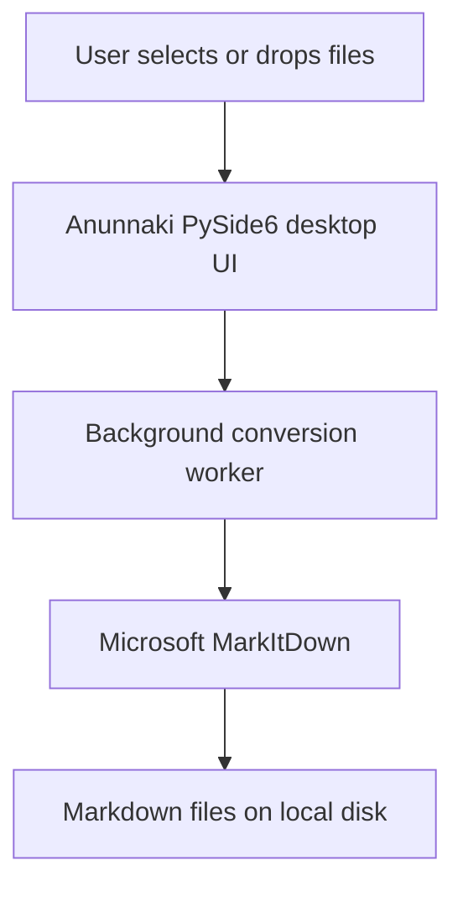

# Anunnaki

> A local Windows desktop experience for turning documents into Markdown.

  

Anunnaki is an independent open-source project based on [Microsoft MarkItDown](https://github.com/microsoft/markitdown). It adds a polished PySide6 desktop interface, local batch conversion workflow, and Windows executable packaging so people can convert documents to Markdown without using the command line for everyday work.

<p align="center">
  
</p>

## Overview

Microsoft MarkItDown provides the conversion engine. Anunnaki provides a user-friendly Windows application around it: select files, review the conversion queue, choose a safe output policy, and produce separate Markdown files locally.

No selected document is uploaded or transmitted by Anunnaki by default.

## Why This Fork Exists

MarkItDown is excellent for scripts, automation, and command-line workflows. Anunnaki exists for people who want the same conversion capability in a focused desktop application:

- No CLI required for normal use.
- Drag-and-drop and multi-file selection.
- Visible per-file progress, success messages, and recoverable errors.
- Safe handling of existing Markdown files: overwrite, skip, or auto-rename.
- A standalone Windows executable for end users without Python.

## Relationship to Microsoft MarkItDown

Anunnaki is an independent derivative of [Microsoft MarkItDown](https://github.com/microsoft/markitdown) and is not affiliated with, endorsed by, or maintained by Microsoft. Microsoft MarkItDown remains the upstream conversion engine and its original copyright notices are retained. See [NOTICE.md](NOTICE.md) for attribution details.

## Features

| Anunnaki desktop additions | MarkItDown-powered conversion |
| --- | --- |
| Dark-friendly PySide6 interface | PDF, DOCX, PPTX, XLSX, CSV, HTML/HTM, TXT, Markdown, and supported image formats |
| Drag-and-drop and file picker | Other formats supported by the installed MarkItDown version |
| Background queue with progress and cancellation | Separate UTF-8 Markdown output for each input |
| Default “save next to source” option (`report.pdf` → `report.md`) | Per-file failures do not stop the rest of the queue |
| Shared output-folder mode | Local conversion by default |

## Screenshots

Screenshots will be added before the first public release. The bundled logo shown above is the application branding.

## How It Works



## Supported Formats

Anunnaki delegates format recognition and conversion to the installed MarkItDown version. Commonly supported formats include PDF, Word (`.docx`), PowerPoint (`.pptx`), Excel (`.xlsx`), CSV, HTML, text, Markdown, and supported images. Optional features and exact support can vary with the MarkItDown dependency set; a failure is reported per file rather than stopping the queue.

## Installation

### Windows

Download the `Anunnaki` release asset, extract it, and run `Anunnaki.exe`. Keep the executable together with its `_internal` folder. Python is not required for this release build.

### Run from Source

Python 3.11+ is required.

```powershell
python -m venv .venv
.\.venv\Scripts\Activate.ps1
python -m pip install --upgrade pip
pip install -e ".[dev]"
anunnaki
```

## Quick Start

1. Open Anunnaki.
2. Drop files onto the window or select **Choose files**.
3. Keep **Save next to each source file** enabled for `report.pdf` → `report.md` in the same folder, or disable it and choose one shared output folder.
4. Select **Convert queue** and choose how to handle any existing outputs.

## Development and Checks

```powershell
ruff check packages tests
ruff format --check packages tests
pytest
pre-commit run --all-files
```

## Building the Windows Application

```powershell
pyinstaller --noconfirm --clean --distpath dist --workpath build packages\doc2markdown_desktop\packaging\Doc2MarkdownDesktop.spec
```

The release-ready layout is produced at `dist\Anunnaki\Anunnaki.exe`. Do not commit this generated distribution; attach a ZIP of the `Anunnaki` directory to a GitHub Release instead.

## Project Structure

```text
packages/doc2markdown_desktop/    Anunnaki GUI, worker, conversion, assets, and packaging
packages/markitdown/              Microsoft MarkItDown conversion engine source
tests/                            Anunnaki output-path and validation tests
.github/workflows/                Upstream checks plus Anunnaki quality and Windows build workflows
```

## Upstream Updates

Microsoft MarkItDown remains the upstream project. After the fork is configured, inspect upstream changes before integrating them:

```powershell
git fetch upstream
git log --oneline main..upstream/main
git switch -c chore/review-upstream upstream/main
```

Do not blindly merge upstream changes into the Anunnaki branch; review dependencies, packaging, and desktop compatibility first.

## Contributing

See [CONTRIBUTING.md](CONTRIBUTING.md). Contributions should preserve the local-first document handling model and retain Microsoft attribution for upstream-derived code.

## License and Attribution

Anunnaki and Microsoft MarkItDown are distributed under the [MIT License](LICENSE). Original MarkItDown portions are copyright (c) Microsoft Corporation; Anunnaki additions are copyright (c) 2026 Louai Al Obaidi. See [NOTICE.md](NOTICE.md).

## Disclaimer

Anunnaki is an independent project, not an official Microsoft product.

If you find this project useful, consider giving it a ⭐. It helps more people discover the project.
