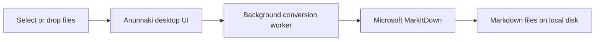

# Anunnaki

> A local Windows desktop app for converting documents into Markdown.

> **Windows users: no Python installation is required.**
>
> Download the latest Anunnaki Windows executable from GitHub Releases and run it.

[](https://github.com/Louai-Al-Obaidi/anunnaki/releases/latest)

Anunnaki is an independent open-source project based on [Microsoft MarkItDown](https://github.com/microsoft/markitdown). It adds a polished desktop interface and a portable Windows executable so normal users can convert documents without a command line, Python, pip, Git, Docker, or development tools.

<p align="center">
  
</p>

## Download

### Windows — recommended for most users

1. Open the [latest release](https://github.com/Louai-Al-Obaidi/anunnaki/releases/latest).
2. Download **`Anunnaki.exe`**.
3. Double-click the downloaded file and use the application.

**That’s it. No separate Python installation is required.** The release EXE bundles the Python runtime and required application dependencies. No installer, command line, pip, Git, Docker, or virtual environment is needed for ordinary use.

## For Users

Use the graphical interface to drop files, choose an output location, and convert them to Markdown. By default, Anunnaki writes `report.md` next to `report.pdf`; the **Save next to each source file** checkbox makes that choice explicit. A shared output folder is also available.

The release is a portable, self-contained Windows executable. If Windows SmartScreen displays a warning for an unsigned open-source application, review the publisher and release page before choosing whether to run it.

## Features

- Drag-and-drop and multi-file selection
- Background conversion queue with progress, per-file errors, and cancellation
- Safe existing-file choices: overwrite, skip, or auto-rename
- Local-first document handling—Anunnaki does not upload selected files by default
- PDF, DOCX, PPTX, XLSX, CSV, HTML/HTM, TXT, Markdown, supported images, and other formats available in the bundled MarkItDown version

## How It Works



## Source Code

The source files in this repository are primarily for developers and contributors. They are public so anyone can inspect the application, audit its behavior, contribute improvements, or build a custom version.

If you only want to use Anunnaki, you do **not** need to clone the repository or configure these files—download the Windows EXE above.

## Project Structure

```text
packages/doc2markdown_desktop/  Anunnaki GUI, worker, assets, and PyInstaller spec
packages/markitdown/            Upstream Microsoft MarkItDown conversion engine
tests/                          Anunnaki validation and output-path tests
.github/                        CI, Windows build workflow, and community templates
```

## For Developers

**This section is only for people who want to modify or rebuild Anunnaki. Normal users should download the pre-built EXE.**

### Developer setup

Python 3.11+ is required only for source development.

```powershell
git clone https://github.com/Louai-Al-Obaidi/anunnaki.git
cd anunnaki
python -m venv .venv
.\.venv\Scripts\Activate.ps1
python -m pip install --upgrade pip
pip install -e ".[dev]"
anunnaki
```

### Checks

```powershell
ruff check packages/doc2markdown_desktop tests
ruff format --check packages/doc2markdown_desktop tests
pytest
```

### Build the self-contained Windows EXE

```powershell
pyinstaller --noconfirm --clean --distpath dist --workpath build packages\doc2markdown_desktop\packaging\Doc2MarkdownDesktop.spec
```

The one-file release candidate is `dist\Anunnaki.exe`; it is the file intended for GitHub Releases. The optional `dist\Anunnaki\` folder is a portable one-folder build for diagnostics and advanced distribution. Neither generated output belongs in Git source control.

## Relationship to Microsoft MarkItDown

Anunnaki is an independent derivative of Microsoft MarkItDown and is not affiliated with, endorsed by, or maintained by Microsoft. MarkItDown provides the conversion engine; Anunnaki provides the Windows desktop workflow. See [NOTICE.md](NOTICE.md) for complete attribution.

## Upstream Updates

Review, rather than blindly merge, upstream changes:

```powershell
git fetch upstream
git log --oneline main..upstream/main
git switch -c chore/review-upstream upstream/main
```

## Contributing, Security, and License

See [CONTRIBUTING.md](CONTRIBUTING.md) and [SECURITY.md](SECURITY.md). Anunnaki additions are copyright (c) 2026 Louai Al Obaidi. Microsoft MarkItDown retains its original copyright and MIT license; see [LICENSE](LICENSE) and [NOTICE.md](NOTICE.md).

If you find this project useful, consider giving it a ⭐. It helps more people discover the project.
